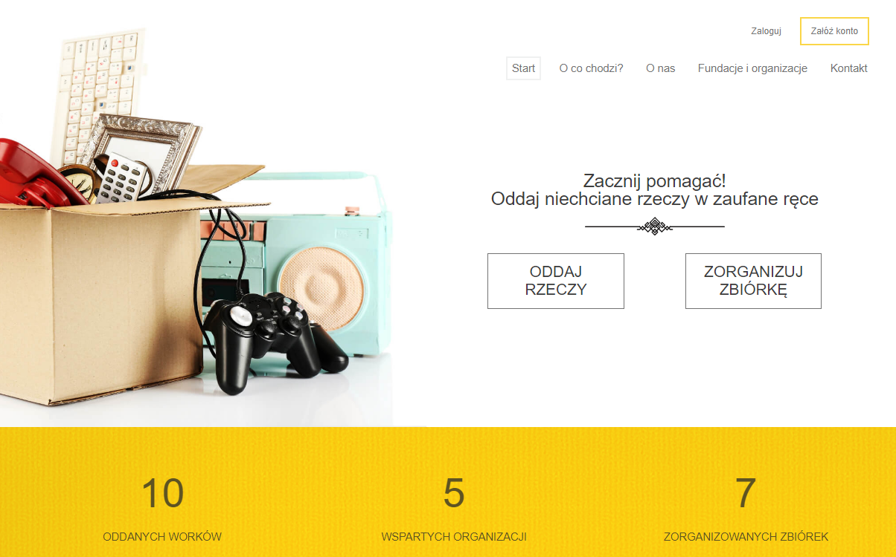

# Put-it-in-good-hands

<h2>About:</h2> 
Put-it-in-good-hands is my second bigger project. The main idea is to encourage people to give unnecessary usable things to others who really need it. Created on the basis of idea and documentation provided by the graphic designer on adobeXD. Technologies what i used is: HTML5, CSS, SASS, Javascript, ES6, React,React Context, FIREBASE, AdobeXD, Trello. App was prepared as a full RWD version. Hosting and Real-Time Database assured by firebase. If you want to clone and play with this repository you could comment firebase code and uncomment fake API by JSON-SERVER and fetch. 

<h2>Application</h2>
To see ready app just click that link: https://put-it-in-good-hands.web.app/#/

<h2>Setup on your machine (requirements : installed Node.js) </h2>
1. Clone repository, 
2. On your terminal use commend: npm i, 
3. and then: npm start
